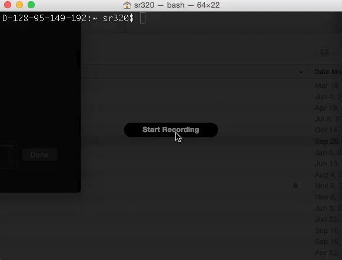
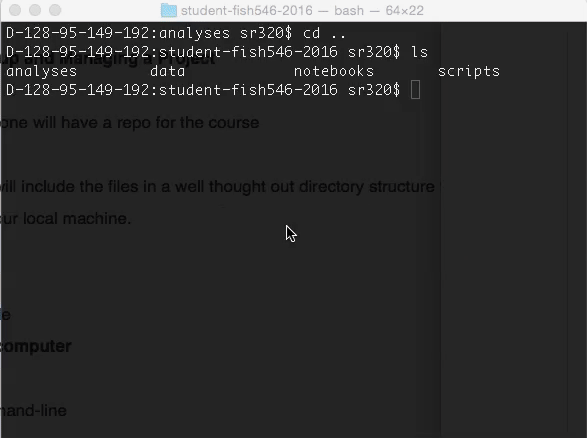

class: center, middle

# FISH 546 
## Bioinformatics for Environmental Sciences

https://github.com/sr320/course-fish546-2016/wiki

##genefish.info

Steven Roberts
@sr320

---
# Today

- Make sure everyone understands/loves BASH
- GitHub
- Setting up a project
- Jupyter
- Proteomics presentation

---

# Housekeeping / Logistics

- Access
- Notifications

---

class: center, middle
# Unix Shell

Everyone good with the tutorial?

---
class: center, middle
# What is the shell and why do you love it?

---

class: center, middle
# Where so you see the most value?

---
class: center, middle
# Why do you fear it, not like it?

---
class: center, middle
# How should you treat your `data`?

---

# Questions

- Streams
- Redirecting
- Redirecting Standar Error
- Pipes

---
class: center, middle
# What is the Golden Rule of Bioinformatics?

---
class: middle

## Setting up and Managing a Project

- ### Everyone will have a repo for the course

- ### This will include the files in a well thought out directory structure that also lives on your local machine.

---

class: middle
## Read the chapter on Setting up and Managing Projects

---
class: middle
## On my computer

at the command-line

---

---
class: middle
add `readme.md`
---

---

---
## You could also start in GitHub, then clone

---

## Project Documentation

-  Document your methods and workflows

--

- Document the origin of all data in your project directory

--

- Document when you downloaded data

--

- Record data version information

--

- Describe how you downloaded the data

--

- Document the versions of the software that you ran

---

class: center, middle
 
# _README_ files
 

---
class: center, middle 

>Ultimately, you’ll arrive at your own project organization system that works for you; the take-home point is: leverage directories to help stay organized.
 
---

## Lets set up some projects

---

## Jupyter

---

# Things to do 

- Quiz
- Project Progress
- Reading 
- Make sure you are getting notificatons

---

