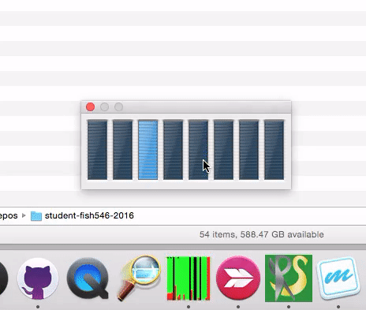

class: center, middle

# FISH 546 
## Bioinformatics for Environmental Sciences

https://github.com/sr320/course-fish546-2016/wiki

##genefish.info

Steven Roberts
@sr320

---
class: center, middle


# Get Organized


---

---
class: center, middle
# Working with Sequence Data & Projects
---
#Power    

---

Owl


---
class: center, middle
# Consider analysis will take longer than your laptop will be open

---
## Data

```
$ head -10 egfr_flank.fasta 
>ENSMUSG00000020122|ENSMUST00000138518 CCCTCCTATCATGCTGTCAGTGTATCTCTAAATAGCACTCTCAACCCCCGTGAACTTGGT TATTAAAAACATGCCCAAAGTCTGGGAGCCAGGGCTGCAGGGAAATACCACAGCCTCAGT TCATCAAAACAGTTCATTGCCCAAAATGTTCTCAGCTGCAGCTTTCATGAGGTAACTCCA GGGCCCACCTGTTCTCTGGT
>ENSMUSG00000020122|ENSMUST00000125984 GAGTCAGGTTGAAGCTGCCCTGAACACTACAGAGAAGAGAGGCCTTGGTGTCCTGTTGTC TCCAGAACCCCAATATGTCTTGTGAAGGGCACACAACCCCTCAAAGGGGTGTCACTTCTT CTGATCACTTTTGTTACTGTTTACTAACTGATCCTATGAATCACTGTGTCTTCTCAGAGG CCGTGAACCACGTCTGCAAT
```

---
The FASTQ format looks like:
```
    @DJB775P1:248:D0MDGACXX:7:1202:12362:49613
    TGCTTACTCTGCGTTGATACCACTGCTTAGATCGGAAGAGCACACGTCTGAA
    +
    JJJJJIIJJJJJJHIHHHGHFFFFFFCEEEEEDBD?DDDDDDBDDDABDDCA
    @DJB775P1:248:D0MDGACXX:7:1202:12782:49716
    CTCTGCGTTGATACCACTGCTTACTCTGCGTTGATACCACTGCTTAGATCGG
    +
    IIIIIIIIIIIIIIIHHHHHHFFFFFFEECCCCBCECCCCCCCCCCCCCCCC
```    

- The description line, beginning with @. This contains the record identifier and other information.
- Sequence data, which can be on one or many lines.
- The line beginning with +, following the sequence line(s) indicates the end of the sequence. In older FASTQ files, it was common to repeat the description line here, but this is redundant and leads to unnecessarily large FASTQ files.
- The quality data, which can also be on one or many lines, but must be the same length as the sequence. Each numeric base quality is encoded with ASCII charac‐ ters using a scheme we’ll discuss later

---
